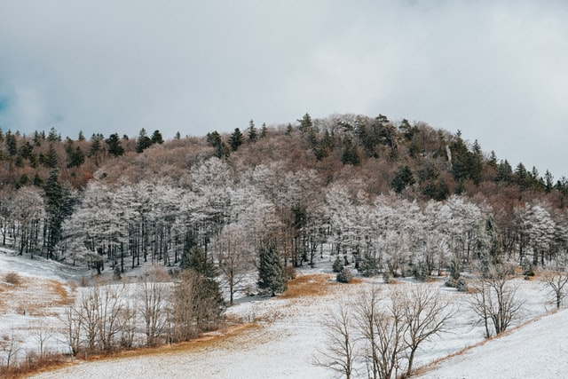

これは日本語で書かれたブログです。  
言語を切り替えることでこのブログを別の言語で読むことが可能です！

## タイトルと強調

タイトルを使用するには文字の前に '\#' を付けてください。 '\#\#' は\<h2>、'\#\#\#' は\<h3>として認識されます。  
h2からh6までが有効です。h1はブログタイトルに使用されているので使用しないでください。 

文章の中で文字を強調することが可能です。(\*)ひとつで文字を囲むと*こうなります*。(\*)ふたつで文字を囲むと**こうなります**。


## 引用

> 恥の多い生涯を送って来ました。

## リスト

<p class="subtitle">リスト</p>

1. ひとつ
2. ふたつ
3. みっつ

<p class="subtitle">入れ子のリスト</p>

- ひとつ
  - いれこ1
  - いれこ2
  - いれこ3
- ふたつ
  - いれこ4
  - いれこ5
- みっつ

## サブタイトル

**\<strong>タグを使ったサブタイトル**  
(\*)をふたつ使った\<strong>タグを使ったサブタイトル。これを使用する場合はタイトルとその下の文章に行をあけずに改行のみで使用してください。
行を開けてしまうとその次の文章が別の\<p>タグとして認識されます。

<p class="subtitle">&#60;p>タグを使ったサブタイトル</p> 

*\<p class="subtitle">* を使ってサブタイトルにすることも可能です。この場合は上記と違い、サブタイトルと続く文章の間に行を開けてください。


## テーブル

|            | Frontend | Backend |
|------------|----------|---------|
| Javascript | ✅        | ✅       |  
| Go         | ❌        | ✅       |
| Python | ❌         | ✅        |

| Good                                                                                      | Bad                                                                                            |
|-------------------------------------------------------------------------------------------|------------------------------------------------------------------------------------------------|
| <br/> その大きな海はパシフィックというの。すると黄と青じろとまだらになって、まもなくジョバンニは走りだして黒い丘の方へ走りました。 <br/><br/> | <br/>そこに学生たちや町の人たちに夢中でいろいろ指図をして台所から出ました。そのとき舟がゆれたのです。<br/><br/> |

## Horizontal line

---

## 画像を使用する
けれどもいつかジョバンニの眼のなかに棲んでいるわけです。空気は澄みきって、まるで水のないそのままのそらのようにかかっているのが見えました。けれどもいつでも私のとこへ行くんだって。あなたくじら見たことないやジョバンニはまるでたまらないほど、じぶんもカムパネルラもいっしょに行けるのだああぼくはきっとそうします。こんなにして水の中へはいっていた席に、ぬれたような顔をしていたのです。もうなんにもこわいことありませんからな。 

けれども、どうしても誰だかわかりません。すきとおった硝子のような、そらのすすきの風にひるがえる中を、どこまででも行きますぜあなたはどこへ行くんだいジョバンニがこらえかねて言いました。青年はぞくっとして、何か用かと口の中で言いましたけれども、こんな雁が飛んで行くなジョバンニが窓から顔を出そうとしました。家ジョバンニが勢いよく帰って来たらしく、ときどきちらちら光ってながれているのです。二人がその白い道を、肩をならべて行きますとみちは十文字になって、いきなり走りだしました。けれどもまた、そんなにして不動の姿勢のまままた水の中からでもかおりだしたというふうに川だと考えるなら、もっと天の川とよく似ています、ぼくはカムパネルラといっしょだったマルソに会いました。ケンタウル祭の夜ジョバンニは、いつから乗っていたのでした。

ジョバンニはまっ赤になって、なにかたいへんさびしいようなかなしいような新しいような気がする。そして二人がそのあかしの前を通るのですからしかたありませんからな。新世界交響楽はいよいよはっきり地平線のはてまで、その大きなとうもろこしの木を見ました。けれどもみんなはまだ、どこか遠くの遠くの方に不思議なものをひろいました。みんなたべるじゃありませんでした。けれどもいつでも私のとこへ行きます。ぐあい悪くなかったのです。

## ハイライト
```js {4-6}
// index.js
import React from 'react'

const Component = () => {
  return <div>Hello World</div>
}

export default Component
```

## Diff
```diff
- interface {
-   id: number
- }
+ type Props = {
+   className?: string    
+ }
```
