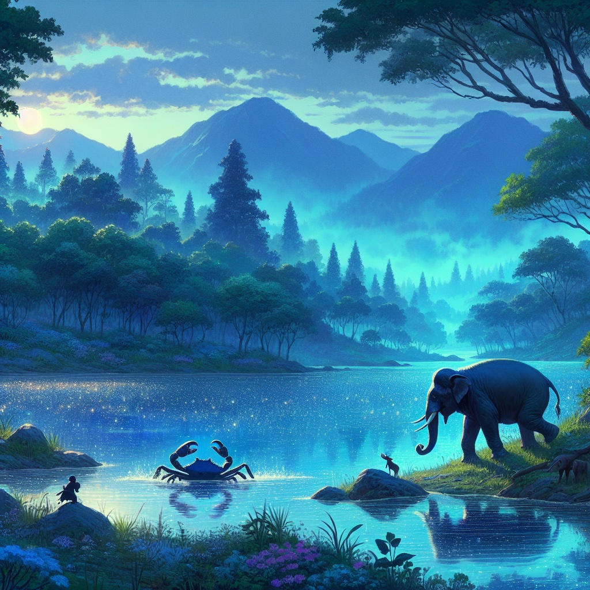

This is the content of English blog post.  
You can read this post in different language, click the language toggle button!

##The Brave Elephant and the Very Big Crab

In the misty mountains of the Himalayas, nestled amidst the clouds, there was a lake that shimmered like a sapphire under the gentle kiss of the sun. This lake was a haven for all creatures far and wide, providing cool, clear water for all who were thirsty. But, hidden beneath the lake's serene surface, a giant crab made its home.

This crab was no ordinary creature; it was so colossal that it had once caught and feasted upon an unfortunate elephant, striking fear into the hearts of all the animals. The elephants, once joyful bathers in the lake's soothing embrace, now trembled at the water's edge.

Amidst this fear, a queen elephant heavy with the promise of new life made a solemn decision. To protect her unborn calf from the lurking terror of the crab, she retreated to a distant haven, where her baby was born far from the shadow of danger.

The calf grew strong and bold under the watchful eyes of his mother. His hide was the color of twilight, and he stood tall and proud like a mountain of shining purple. As he grew, tales of the giant crab reached his ears, tales of terror and of his family's sorrowful separation. A spark of determination ignited within him, a resolve to face the monster and restore peace to his kin.

The young elephant, wise beyond his years, sought his father's blessing for his perilous quest. The king, his heart heavy with both pride and fear, granted his son leave to embark on this noble endeavor.

With a clever plan devised, the young elephant, who would come to be known as the Bodhisatta, rallied his friends for support. They would go to the lake, and upon leaving, he would stay behind, drawing the crab out with his sacrifice.

As the animals drank their fill and left the water's edge, the Bodhisatta remained, resolute and brave. True to his plan, the giant crab emerged, clamping onto his leg with a vice-like grip. The other elephants scattered in panic, but the Bodhisatta's mate stayed behind, her loyalty unwavering.

With sweet words and praises of the crab's unrivaled strength, the mate elephant swayed the creature, beguiling it to loosen its hold. At that moment, with a triumphant cry, the Bodhisatta summoned his friends back to his side.

Together, they overpowered the crab, pulling it ashore and ending its reign of terror. From that day forward, the lake once again became a place of tranquility, a sanctuary for all animals to quench their thirst without fear.

And as for the claws of the defeated crab, they embarked on a journey of their own, becoming the stuff of legends, transformed into drums that thundered like the clouds, echoing the bravery of the Bodhisatta across lands and time.

The End
